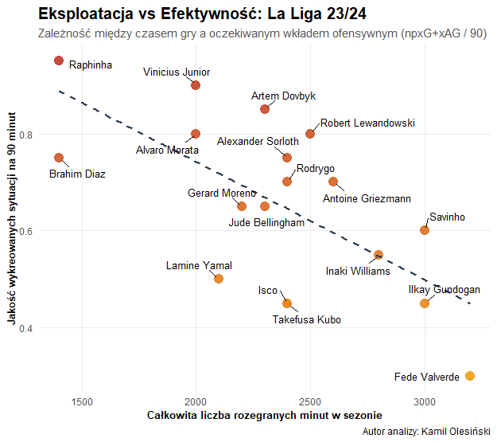

# ⚽ Analiza Wydajności i Obciążenia Zasobów (Sports Analytics: La Liga)

## 🎯 Cel Projektu
Głównym celem analizy jest zbadanie wpływu obciążenia pracą (liczba rozegranych minut) na efektywność operacyjną zawodników ofensywnych. Projekt symuluje analizę ryzyka „przepalenia” aktywów w wysoce intensywnym środowisku, wykorzystując zaawansowane metryki piłkarskie z hiszpańskiej La Ligi (sezon 2023/24).

## 🛠 Wykorzystane Technologie
*   **Język:** R
*   **Kluczowe biblioteki:**
    *   `dplyr` – czyszczenie, transformacja i agregacja danych (Data Wrangling).
    *   `ggplot2` – tworzenie zaawansowanych wizualizacji biznesowych.
    *   `ggrepel` – optymalizacja rozmieszczenia etykiet na wykresach punktowych.

## 🔬 Metodologia i Wskaźniki
Aby zapewnić miarodajność wyników, dane zostały wystandaryzowane. Zbudowano autorski wskaźnik jakości:
*   **npxG+xAG per 90:** (Oczekiwane Gole bez rzutów karnych + Oczekiwane Asysty) w przeliczeniu na pełne 90 minut gry.
*   Standaryzacja pozwala na obiektywne porównanie zawodników z pierwszego składu (np. Jude Bellingham, Robert Lewandowski) z graczami, którzy wchodzą z ławki rezerwowych, ale generują dużą wartość dodaną (tzw. *impact subs*).

## 📈 Kluczowe Wnioski

> **💡
>

**Główne obserwacje z modelu:**
1.  **Linia trendu (Trade-off):** Wykres wyraźnie pokazuje odwrotną korelację. Wraz ze wzrostem obciążenia (powyżej 2800 minut), średnia jakość wykreowanych sytuacji na 90 minut zaczyna spadać (tzw. efekt zmęczenia materiału).
2.  **Konie robocze (Workhorses):** Zawodnicy tacy jak Fede Valverde czy Ilkay Gundogan notują ogromną liczbę minut. Ich wskaźniki ofensywne są niższe, co wynika z głębszego ustawienia na boisku oraz konieczności zarządzania siłami (optymalizacja wydatku energetycznego).
3.  **Wysoka efektywność rotacji:** Gracze z mniejszą liczbą minut, tacy jak Raphinha, charakteryzują się bardzo wysoką efektywnością (npxG+xAG bliskie 1.0). Sugeruje to, że odpowiednie zarządzanie czasem gry (minimalizacja ryzyka przeciążenia) maksymalizuje "zwrot z inwestycji" w pojedynczym meczu.

## 🚀 Jak uruchomić projekt lokalnie?
1. Sklonuj repozytorium na swój dysk.
2. Otwórz plik skryptu w programie RStudio.
3. Upewnij się, że posiadasz zainstalowane biblioteki: `install.packages(c("dplyr", "ggplot2", "ggrepel"))`.
4. Uruchom skrypt – zbiór danych (Data Frame) jest wbudowany bezpośrednio w kod, co gwarantuje natychmiastową i bezproblemową generację wykresu.

## 👨‍💻 Autor
**Kamil Olesiński**
*   https://www.linkedin.com/in/kamil-olesiński-138a3a423/
*   Student Ekonomii | Licencjat z Matematyki w Finansach
